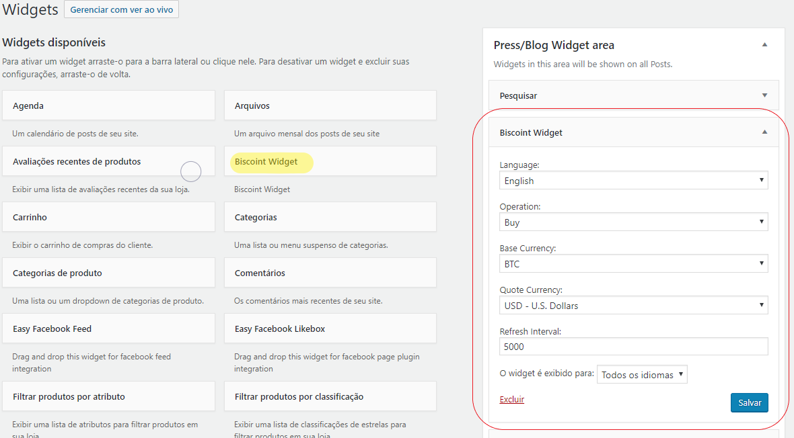

# Biscoint Wordpress Widget Plugin

This is a Wordpress plugin which creates a Widget inside Wordpress which makes it easy to add the Biscoint price to any Widget area of your site, such as the sidebar.

To use it, first download the last release .zip file, and then, inside the admin area of your wordpress site, go to Plugins > Add new > Upload Plugin (if you don't know how to do this, here's a [nice blog post](https://www.wpbeginner.com/beginners-guide/step-by-step-guide-to-install-a-wordpress-plugin-for-beginners/) with detailed instructions).

After install is complete, you'll be shown the option to activate the plugin. Do so.

Then go to Appearance > Widgets. A screen like the one below appears:

 

Notice a new widget called "Biscoint Widget" is available. You can drag and drop it to any section of your site ([learn more](https://www.wpbeginner.com/beginners-guide/how-to-add-and-use-widgets-in-wordpress/)). Then you can change the default parameters or leave them as they are, then click 'Save'.

The result will be like this:

